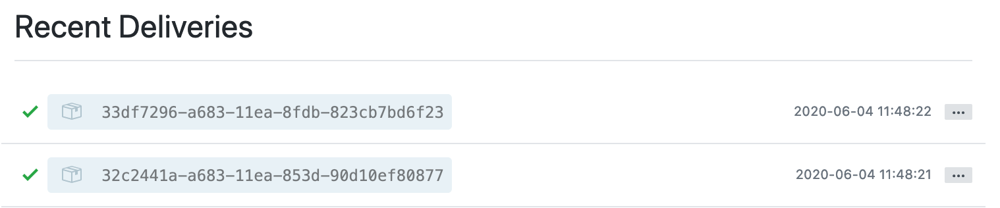

# Cloud Pak Acceleration Team  - CPAT
# Tekton Webhook Guide
#### Use this guide with an Openshift or Kubernetes cluster after you have installed the Tekton Pipeline Operator.
#### Before this webhook will work, you must first follow the guide in the [../resources](../resources) directory of this repository.
#### This directory contains YAMLs for creating a TriggerTemplate, TriggerBinding, and an EventListener. These resources are required for making a webhook with Tekton Pipelines. With a Tekton Webhook, you can initiate a pipeline after GitHub source code management events occur. This guide will assist you to create a webhook that fires after git push events.

**Please note:** Any space containing carrots should be *replaced* ( Carrots should be removed as well )

Example:
```yaml
metadata:
  name: <fill-in-resource-name>
```
Should become
```yaml
metadata:
  name: cp4a-resource
```

## TriggerBinding
###### The TriggerBinding extracts information from the webhook payload and then passes the selected information to the TriggerTemplate as params
  - *trigger-binding.yaml*
    1. This file doesn't require any changes, but you may change the *metadata/name*

## TriggerTemplate
###### The TriggerTemplate contains the necessary Tekton resources to be created (Ex: PipelineRun, PipelineResource)
  - *trigger-template.yaml*
    1. You may change the *metadata/name*
    2. Fill in a desired name (metadata/generateName) to be generated for your PipelineRun. Note the hanging dash is for separating the 5-character ID/hash from the specified PipelineRun name
    3. The *spec/pipelineRef/name* value must be modified to match the name of the Pipeline you would like to initialize with this webhook
    4. Modify the *resources* block below if your pipeline requires more than 1 git resource and 1 image resource
    
        ```yaml
        resources: # Add resources as necessary for your target pipeline here
          - name: docker-image # This pipeline resource should already exist in your cluster
            resourceRef:
              name: docker-image
          - name: git-source # This pipeline resource will be created from the Github webhook
            resourceSpec:
              type: git
              params:
                - name: revision
                  value: $(params.gitrevision)
                - name: url
                  value: $(params.gitrepositoryurl)
         ```

## EventListener
###### The EventListener creates a pod and service that are used to handle webhook payloads. A Route to this Service will be necessary if one is intending to use this for source code management outside of the cluster.
###### EventListener Tekton CRDs automatically create an associated Pod and Service for handling webhook payloads. The name of this Service and Pod will be prefixed with "el-". This will be important in the Route section that follows.
  - *trigger-listener.yaml*
    1. You may change the *metadata/name*
    2. The *template/binding* field must match the *metadata/name* field of the TriggerBinding
    3. The *template/name* field must match the *metadata/name* field of the TriggerTemplate
    
## Route
###### This Route will be used for external access to the internal EventListener Service
  - *event-listener-route.yaml*
    1. You may change the *metadata/name*
    2. The EventListener label should match the name of the EventListener
    3. the *spec/to/name* field must be of the following format:
      
        ```yaml
        spec:
          to:
            kind: Service
            name: el-<event-listener-name>
            weight: 100
        ```
      **if the prefix "el-" is removed, the route will not match up to the EventListener Service**
      
## Creating the GitHub Webhook
###### This portion of the guide will show you how to create a GitHub webhook to send payloads to the EventListener Route we created earlier. Use CLI or Git UI

### CLI Example

- This is only possible if your OpenShift cluster is accessible from the github server (ie github.com)

The example below applies to the following IBM CPAT git repo
```bash 
https://github.ibm.com/cpat/cp4a-gitops-tekton-argocd-nodejs
```

- Set the `GIT_REPO_NAME` to name of the Code Git repo like `cp4a-gitops-tekton-argocd-nodejs`
  ```bash
  export GIT_REPO_NAME='<GIT_REPO_NAME>'
  ```

- Set the `GIT_REPO_OWNER` to name of the Code Git repo like `cpat`
  ```bash
  export GIT_REPO_OWNER='<GIT_REPO_OWNER>'
  ```

- Run curl to create the web hook
  ```bash
  curl -v -X POST -u $GIT_USERNAME:$GIT_TOKEN \
  -d "{\"name\": \"web\",\"active\": true,\"events\": [\"push\"],\"config\": {\"url\": \"https://$GIT_WEBHOOK_URL\",\"content_type\": \"json\",\"insecure_ssl\": \"0\"}}" \
  -L https://api.github.ibm.com/repos/$GIT_REPO_OWNER/$GIT_REPO_NAME/hooks
  ```
### with Git UI

  1. Get the Route URL (HOST/PORT)

```bash
oc get route cp4a-el-route -o jsonpath='{.spec.host}'
```

  2. Navigate to the GitHub repository of your choice
    - You will need admin access on this repo
  3. Click the Settings tab
  

    
  4. Hooks
  5. Add Webhook at the top right
  6. Fill in values to match this image
  
      **URL must have https:// prefix**
    

  7. Add Webhook

## Testing the GitHub Webhook
###### Make a minor change to code, and push to repo. If you use the web UI to push, there is currently a bug that will cause two push events to occur. This error doesn't occur when using the command-line to push.

  1. Check that a payload was sent to the EventListener Route
  


  2. Check to ensure that your pipeline began
  ```bash    
  oc get pipelinerun
  ```
  **or**
  ```bash
  tkn pr ls
  ```    

